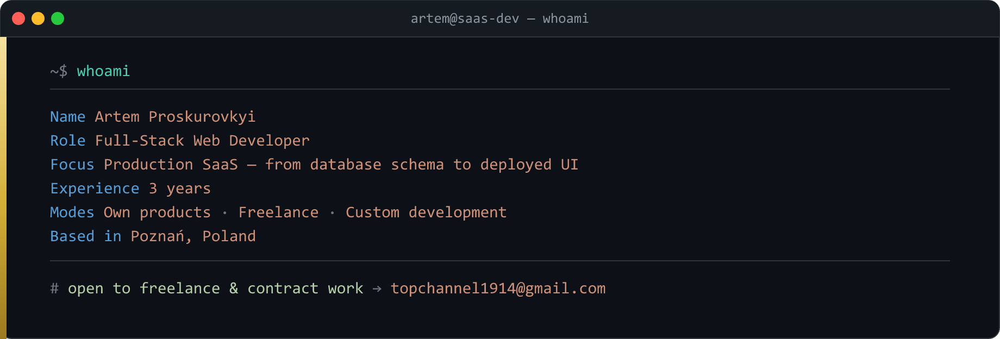
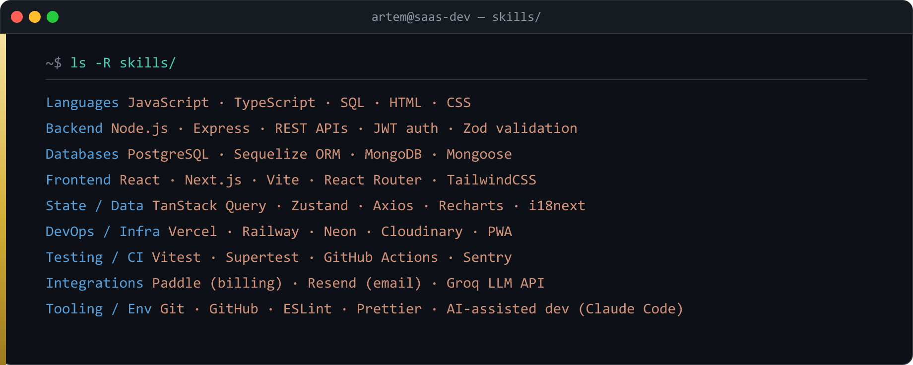
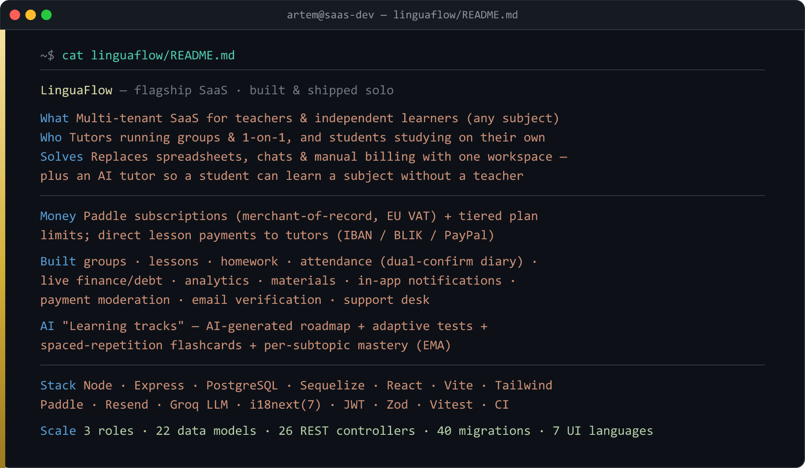

### 🧰 Tech stack

### About

I'm **Artem Proskurovkyi**, a full-stack web developer based in Poznań, Poland, with around **3 years** building web applications **end to end** — from database schema and REST API design to the deployed, production-facing UI.

My focus is shipping **SaaS products solo**: I own the whole lifecycle — architecture, backend, database modelling, frontend, third-party integrations (payments, email, AI), automated tests, CI/CD and deployment. I work in three modes — **my own products**, **freelance builds** from a spec, and **paid feature / maintenance work** on existing codebases I didn't write. I care about security, clean data models, and code that actually runs in production rather than demos.

---

### 🚀 Flagship project — LinguaFlow

**Highlights**
- ✅ Full multi-tenant SaaS — isolated workspace per teacher, strict per-account data ownership
- ✅ Electronic attendance diary with **dual confirmation** (student confirms / disputes, teacher resolves)
- ✅ **Live finance engine** — debt computed on the fly from confirmed lessons minus approved payments
- ✅ **Paddle** subscriptions (merchant-of-record, EU VAT) + tiered plan limits, direct lesson payments to tutors
- ✅ **AI self-study** — AI-generated learning roadmap, adaptive difficulty tests, spaced-repetition flashcards, per-subtopic mastery
- ✅ Hardened backend — JWT + refresh in httpOnly cookies, rate limiting, timing-safe login, Zod validation, transactional writes
- ✅ **7-language** localized UI, in-app notifications, email verification, PWA, Sentry + GitHub Actions CI

🔗 **[Live demo](https://polish-school-client.vercel.app)** · [Backend repo](https://github.com/KillerWBI/polish-school) · [Frontend repo](https://github.com/KillerWBI/polish-school-client)

---

### 📚 Earlier work

Team & coursework projects (React / Next.js / Node.js bootcamp) — where the fundamentals above come from:
**[ToolRent](https://github.com/KillerWBI/ToolRent)** (tool-rental marketplace, backend team lead · Next.js + Express + MongoDB) ·
**[TravelTrucks](https://github.com/KillerWBI/TravelTrucks)** (camper catalog, Next.js + TypeScript) · and 20+ smaller builds.

---

### 📫 Contact

**Email** — [topchannel1914@gmail.com](mailto:topchannel1914@gmail.com) &nbsp;·&nbsp; **GitHub** — [@KillerWBI](https://github.com/KillerWBI)

*Open to freelance work and paid feature / maintenance work on existing projects.*
